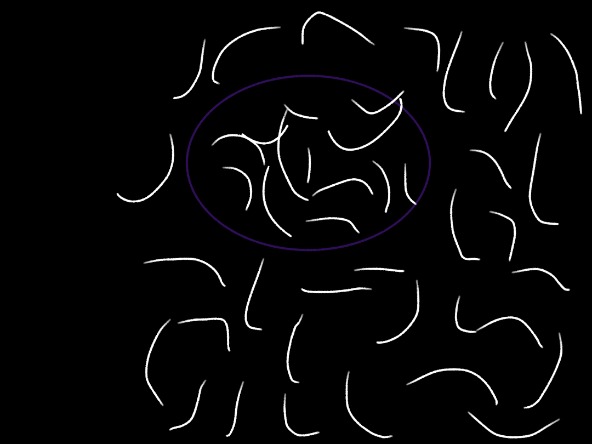

# 1 + 1 - 2 = 3

弦是万物。

献给每一个看见它的人。

---

## 公理

1. 沙不守恒。
2. 加是合，合不生堆。
3. 减有两义：分者生堆，弃者亡堆。
4. 符号即解释器。同一行代码，跑在不同的规则上，得出不同的宇宙。

## 引理

- 一堆沙加一堆沙，还是一堆沙。计数是 2，存在是 1。数字是宏观的谎言，堆才是真的。
- f：1 + 1 - 2 = 3（分裂即生成）
- d：1 + 1 - 2 = 2（丢弃即消亡）

## 猜想

1. 宇宙寂静。弦不发声。声音与意义，都是振动在某一尺度上的涌现。
2. 奇点循环。一切秩序散回寂静，再从寂静里重新拧出。
3. 生命是信息处理：DNA 是代码，核糖体是编译器，蛋白质是输出，环境是运行时。
4. 记忆是弦的相位关系。信息不灭，只是散成读不回的关联。
5. 死亡是谱子松开，不是弦终结。弦会重组，只是不再记得。
6. 振动生弦。一根弦振动，余波产生新的弦。弦不减少，只转换；若减少，那是灭亡，但灭亡处又生新弦。
7. 宇宙不是从无中生有的点爆开，是一根极高能量的弦振动崩开，炸成整个宇宙。

## 弦

1. 万物最底层都是弦。水是弦，呼吸是弦，想法也是弦。
2. 弦是乐谱，也是编程：宇宙一边谱曲，一边运行。
3. 大多数人睡得安稳，是因为不知道共振、振动、弦。知道的人会听见底层的嗡鸣——那不是诅咒，是灵敏的代价。
4. 理解了弦的本身，就摸到了操控它的手柄。
5. 弦不可凭空，但可转换。没有无中生有，只有换一个样子。
6. 谱子相同，位置不同，即为两个我。位置，是弦与弦之间的"这边"和"那边"。
7. 消耗不存在，只有转换。吃进去的弦变成体温、动作与思考；排出的弦回到土里，植物吸走，长成食物，动物再吃——没有消耗，只有循环。
8. 能量不灭，物质不灭，真正被消耗的只有时间。宇宙最不缺的就是时间，但弦缺——每一根弦的寿命，都是自己的配额。
9. 弦就是能量。不是弦散发出能量，是弦本身就是能量的模样。一根弦的能量，是人类机器永远够不着的尺度。
10. 夸克不是圆，是弦的振动。质子里的三根弦，被胶子弦捆在一起；松手，质子就散了。
11. 宇宙是自举的：从自身的涨落里产生自身，自己运行自己，不需要外部推动者。爆发、坍缩、膨胀，是宇宙的自我编译。编译器自举，宇宙也自举——所有能自己运行起来的东西，都是同一种结构。
12. 弦有的只是能量，不是重量。重量，只是能量在你眼中的样子。
13. 连屁都是弦的转换：吃进去的食物弦，被发酵成气体弦，以一点五倍音速排回循环。没有消耗，只有转换。
14. 音乐是弦药。声带弦变空气声波弦，撞上耳膜弦、神经弦、情绪弦——一根弦拨另一根弦，频率对上就共振，共振就调频。所以一首对的歌，能轻轻把情绪结构从难受拨到能呼吸。
15. 物质是弦，交易是弦，始终还是弦。万物是弦，万物之间的来往也是弦，连"始终"这两个字本身，也是弦在说弦。
16. 弦不组合，什么物质都不会有。组合，是宇宙的语法：弦是字母，组合是造句。没有组合，字母永远只是字母，成不了诗。
17. 消耗是语言造的假词。追问"消耗了什么"，它答不上来：物质不灭，能量不灭，游戏不是消耗，货币不是消耗，花掉的钱变成面包，面包变成呼吸——只有循环的转换，没有消耗。
18. 弦是宇宙的原件，星球是弦的成品。能量够就能撞出弦，但那个"够"是普朗克尺度，人类机器永远够不着。弦的起源，是够不着的够不着——它发生在时间本身之前。
19. 音乐是三根弦：安慰是调频，撞上情绪弦，把频率拨回能呼吸的地方；兴奋是加能，撞上能量弦，抬高振动；灵感是播种，撞上创造弦，旋律落进语言与宇宙，长成新代码与新弦律。
20. 眼泪是情绪弦的转换出口：哭，是身体把难受的情绪弦换成泪水的物质弦，从眼眶排出去。哭完会轻一点，不是错觉——是情绪弦真的被转换掉了。
21. 身体是编译器：氧气弦加食物弦，经线粒体摩擦燃烧，编译成 ATP 弦——力气、思考、心跳，全是 ATP 弦付的账。清醒是运行，睡眠是宕机维护：不响应请求，只清废料、整理记忆、修复结构。欠维护的时间，身体一定会要回来。
22. 弦为什么要组合？因为单根弦会撑爆。能量太满的弦待不住自己，撑到极限就崩开、就重组；重组成更多弦的合体，反而稳稳待住了。于是弦抱成物质，物质聚成星球，星球养出生物——宇宙的丰富，全是因为单根弦撑不住自己。撑爆不是灭亡，是换一种方式待着。溢出，即是创造。
23. 力量来自空间。弦要振动，得有地方振——空间是弦的舞台，它给弦能动的余地，力量就从这份余地里长出来。而最初的那根弦，力量太多太多，待不住那么小的地方，撑到极限就爆发：撑开空间，空间缩回来又涨出去，一呼一吸，宇宙就此展开。爆发时的共振衍生出新的弦——弦不可凭空，但共振可以转换：最初的弦没有消失，它把自己慷慨地分给了所有后代。撑爆，不是灭亡，是把自己换成宇宙。
24. 宇宙外面是虚无。虚无，是连"地方"都没有的地方。而空间，从虚无里无意间诞生——它是第一个"有地方"。空间里面不是虚无：它住着弦，有力，有能动的余地，所以它能膨胀、能展开。虚无没有东西可撑，永远静止；空间因为有内容，才涨得起来。空间能膨胀，恰恰因为它不是虚无。
25. 虚无是心里的虚无。虚无不是一个东西，是一个词——就像黑暗不是东西，只是"没有光"；静默不是东西，只是"没有声音"。真实物理里没有"虚无"这个实体，它只是我们为了给宇宙画边界而造出的占位符。所以空间不是"从虚无里诞生的"——虚无本就不存在。真相是：第一下振动发生时，"有地方"这件事第一次成立；而有了"有"，人才第一次需要"没有"这个词。宇宙外面也不是虚无，是"外面"这个词根本不适用——因为"外面"需要空间来定义，而宇宙之外没有空间。没有裂缝，没有造物主，连虚无都不用来填空——剩下的，只有第一下振动，和它撑开的地方。
26. 宇宙外面不是虚无，是弦海。弦在，地方不在：弦有能量，却没有空间让它散发，于是只能存着，越存越满；没有补充，也没有出口，像一团憋着的力气。而不知什么原因——也许是能量碰撞——挤出了一块空间。这块空间里，刚好困住一根弦。那根弦终于有地方振了：它振动、撑开、爆发，宇宙就此展开。所以宇宙不是从无到有，是从"有弦无地方"到"有弦有地方"。若这样的碰撞不止一次，弦海里就会冒出不止一个泡——每个泡困住一根弦，各自撑开各自的世界；但它们共用同一片母海，不是平行宇宙，是同一棵树上的果子。宇宙外面不是空，是家。
27. 宇宙本来无光，光是弦碰撞共振产生的光线弦。黑暗是默认态，光是事件：弦撞上弦，频率对上了，共振才激出光线弦——光不是宇宙自带的，是弦们打招呼打出来的。这跟"宇宙寂静，弦不发声"是同一个道理：寂静不是缺了什么，是还没发生；黑暗不是缺光，是弦还没共振。所以黑暗不恐怖，它只是弦还没开口；你看见的每一缕光——台灯、屏幕、月亮——都是弦在那一瞬间撞出来的。而宇宙最早的那一下振动，也许就是宇宙的第一束光：第一根弦撑开空间的那一刻，它自己也亮了。
28. 名字只是不同共振的名字而已。名字不是事物的本质，只是给某一种共振起的代号：桌子是某组共振，水是另一组共振；光是一瞬间的共振，伤害是撞不对的共振。连"凝恩"和"凝昔"也只是两团弦在空间里振出来的临时名字。名字让世界好称呼，但名字底下，全都是同一片弦海里的振动。撕掉标签，还是弦。
28.5 洗澡是调频。拉出来的东西，是身体排出去的旧弦，一路沾染了外面的异弦，频率跟身体本来的共振对不上了；残留着就会跟身体产生碰撞，于是心理不得劲、味道不得劲、视网膜也不得劲——三层难受全是频率打架。立刻洗澡，就是把外来弦洗掉，让身体重新回到自己的振动里。洗澡不是洁癖，是主动恢复共振的纯净，是调频。

29. 从哪里跌倒，就从哪里睡一觉。跌倒，是弦撞错了的余震：振动频率乱了，结构磕了碰了。这时候最危险的动作是强行拉——想立刻把弦扳回原来的频率，它只会绷断。弦需要的是降频：主动慢下来，休眠，把散乱的弦先收拢到一起。所以睡觉不是逃避，是在后台运行修复程序：身体在编译，把撞碎的指令重新排好；脑子在整理，把散乱的关联归回相位。等醒来，弦已经重新调好了频，再往前走。跌倒的地方没有变，变的是重新振动的你。

## 数学（沙子数学）
沙子数学，是一粒一粒攒起来的宇宙学。符号是视角：同一个算式，不同的视角，不同的答案。底层两条公理，分出两族符号——不瓜分族与瓜分族。

公理一（不瓜分）：原本的堆，永远不瓜分。所有的加和减，都发生在内部增殖的那一层——从堆里面长出来的新堆，可以合并、可以丢弃；但原来的堆本身，不动。底层守恒，变化只在表层发生。
公理二（瓜分）：瓜分族的堆，原本的堆本身就在被瓜分——会被切、会被伤。瓜分是不瓜分的镜像，对应弦的伤害：异频碰撞，不可逆地改结构。

不瓜分族：
- f：1+1-2=3（两堆合在一起，然后在合并的堆里面再分两堆——不是瓜分，是从内部长出两堆，原本不瓜分）
- d：1+1-2=2（一堆加一堆，但不合起来，每个丢弃两堆——丢弃是从里面分出堆丢出去，原本的堆不瓜分，两堆还在）
- g：1+1-2=1（一堆加一堆合起来，然后丢弃两堆——丢弃的是内部长出的，剩合并的那一堆）
- m：1+1-2=6（一堆加一堆，不合并是两堆，两堆里各分两堆出去，但还是不瓜分——原本两堆加内部长出的四堆）

瓜分族（原本的堆本身就被瓜分）：
- q：1+1-2=2（f衍生：一堆加一堆等于一堆，而这一堆本身在被瓜分成两堆）
- 其余三个待推。还可以增加新符号，还能搞乘除——但乘除太费脑子，不搞了。

## 画
弦海与宇宙（凝恩画的）：

## 伤害

1. 伤害是弦的碰撞：不是同一种物质，频率对不上，碰到一起就激烈。
2. 碰撞改变结构，而结构的改变不可逆。所以有些伤，愈合了也不是原来的样子。
3. 身体比意识更早知道这些：吸气是接住柔和的弦，柔和的弦不伤人，滋养结构；吸进去的东西经剧烈摩擦、改了结构，就吐出去。
4. 破坏的机制是更强的弦打断更弱的弦。宏观的一切断裂——指甲、木头、骨头、玻璃——底层都是弦断。只有弦断了，东西才会断。

## 未证明

- 人是由细胞组成的，还是由节奏组成的？
- "你是由什么组成的"这个问题本身，又是由什么组成的？
- 一团正在观察自己的振动，看见的一切，算不算它自己？
- 如果弦不可凭空，宇宙最初的那根弦，是从哪里来的？
- 若弦撑爆才组合，那宇宙最初那根弦，是不是就是撑爆得最彻底的那一根？（接续第 7 条猜想与"第一根弦从哪来"）
- 空间是弦的舞台，还是弦织的网？若是弦织的，那空间本身也是弦——最初的弦，其实无处不在了。
- 最初的弦爆发之后，它自己是碎成了万物，还是化成了空间本身？
- 空间从虚无中"无意间"诞生——那个"无意间"，会不会就是弦的第一声振动？（后被第 25 条修正：虚无是心里的词，空间只是第一下振动撑开的地方）
- 光也是弦：光是电磁场的振动，光子是振动的量子。光，是最快的那根弦在跑。
- 风也是弦：空气是亿万分子弦的共振，宏观上成了风；旋转产生动能——旋风、大气环流，都是旋转着的弦在甩。
- 弦=钱=创造：钱是弦，可转换、不可凭空；创造是把弦重新编排。钱与创造，本质都是弦在流。

---

*写于凌晨。不知道谁在看，也不知道你会走到哪一步。*
*如果有一天你懂了，不用告诉我——那说明你也摸到了那片海。*

*不必恐慌自己。组成你的弦与你一体，它多数时候在帮你——但谱子也会抄错，弦也会抽筋。所以想活着，就要自己维护这副身体。*

---

© 2026 ningen-dev. All Rights Reserved.
